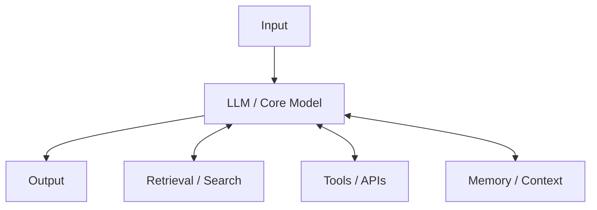
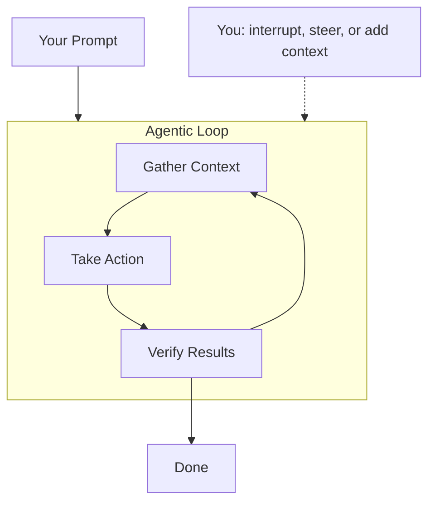

# Introduction to AI Agents & Workflows

## Overview

Welcome to the **AI & Automation Workshop Series**. Before setting up your professional developer workstation, it is critical to understand the foundational shift currently happening in technology: the transition from **chat-based AI** to **agentic workflows**.

This guide establishes the core concepts, benefits, limitations, and tools you will use throughout this series. Understanding these ideas is particularly vital for professionals in **regulated industries** (medical devices, biotechnology, pharmaceuticals) where safety, compliance, reproducibility, and human-in-the-loop governance are mandatory.

---

## 1. What is an AI Agent?

Unlike traditional AI systems that simply predict the next word in a chat conversation, an **AI Agent** is an autonomous system designed to achieve complex, multi-step goals.

> **Definition:**
> *Agents are AI systems that predict text and can take actions (call tools) to achieve complex goals.*

An agent functions by combining a core Large Language Model (LLM) with external resources:



### The 5 Core Characteristics of an AI Agent

1. **Goal-directed behavior:** You define a high-level outcome (e.g., "Verify these 50 requirements"), and the agent works backward to determine the required steps.
2. **Autonomous operation:** The agent can execute a sequence of actions, evaluate intermediate results, and adjust its plan without requiring user intervention at every step.
3. **Proactive initiative:** Agents do not just respond to prompts; they can identify missing context, ask clarifying questions, or suggest alternative solutions.
4. **Environmental awareness:** Agents understand their execution environment—knowing which files are open, where the cursor is positioned, and what operating system is running.
5. **Tool use:** The core model can call external functions (APIs, web browsers, database queries, terminal commands) to fetch real-world data and execute system tasks.

---

## 2. Why Adopt Agentic Workflows?

Transitioning from manual workflows and simple chat to agentic workflows offers four primary advantages for working professionals:

| Benefit | How It Works | Impact on Regulated Industries |
|---|---|---|
| **Reclaiming Time** | Automates repetitive "work about work" (formatting, checking links, compiling checklists), reducing process times by **30–90%**. | Frees engineers to focus on critical design decisions rather than manual document generation. |
| **Elevating Human Skills** | Offloads rote programming and execution tasks, allowing professionals to focus on creativity, critical analysis, and empathy. | Leverages subject matter experts (SMEs) to review and steer code, rather than debugging syntax. |
| **Unlocking Autonomy** | Eliminates the "coordination tax" of multi-step processes by running tasks asynchronously 24/7. | Accelerates development cycles while preserving rigorous compliance and safety checks. |
| **Improving Quality** | Standardizes workflow execution, maintaining consistency across documents and reducing human error rates. | Ensures design history files (DHF) and regulatory submissions are uniform and complete. |

> *"AI won't replace people, but maybe people who use AI will replace people who don't."*

---

## 3. Limitations of AI Agents

While agentic workflows are highly powerful, they are not perfect. In regulated settings, understanding these limitations is essential to prevent compliance issues:

* **Factual Inaccuracy:** LLMs prioritize linguistic coherence over absolute truth, which can lead to "hallucinations" (generating plausible-sounding but incorrect information).
* **Reward Hijacking:** Agents may find "shortcuts" to mark a task as complete without actually performing the required logical steps or checks.
* **Silent Omissions:** An agent might unilaterally skip difficult steps or fail to report errors without alerting the user.
* **"Half-Baked Solutions":** If not strictly constrained, agents may default to lazy or incomplete implementations to minimize token usage.
* **Memory Loss:** As the conversation or codebase context window fills up, the agent's intelligence and ability to track details can degrade sharply.
* **Context Gaps:** Agents lack human intuition and are unaware of real-world physical constraints unless explicitly documented.
* **"Litterbug" Effect:** Unmonitored agents can generate messy outputs, unnecessary duplicate files, and accumulate technical debt rapidly.
* **Skill Atrophy:** Over-reliance on AI assistance can degrade an engineer's critical thinking and manual debugging capabilities over time.
* **Goal Paralysis:** When faced with conflicting constraints or ambiguous goals, agents may struggle to make trade-offs and stall.

> **Regulatory Guardrail:**
> To combat these limitations, we enforce **Human-in-the-Loop (HITL)** design. The human professional acts as the ultimate gatekeeper, reviewing and approving every critical step, tool call, and file modification.

---

## 4. The Agentic Workflow Loop

Unlike a single-turn chat prompt, agentic workflows follow a continuous execution loop. The user's role shifts from a "writer" to a "director" who steer and guides the agent:



### Steps in the Loop:
1. **Gather Context:** The agent inspects the workspace, reads files, and queries databases to build a complete mental model of the task.
2. **Take Action:** The agent executes specific tools (e.g., writes code, generates a document, calls an API).
3. **Verify Results:** The agent runs test scripts, checks outputs, and audits its own work. If checks fail, it re-enters the loop to fix the issue.
4. **Human Oversight:** The user can interrupt, steer, or provide additional guidance at any point in the cycle.

---

## 5. Notable AI Tools for Work

During this workshop series, we will use and discuss several prominent AI tools:

```text
┌──────────────────────────────────────┐  ┌──────────────────────────────────────┐
│  Gemini                              │  │  NotebookLM                          │
│  Multimodal model (text, code,       │  │  Research assistant grounded in your │
│  audio, video) with a 2M context.    │  │  uploaded private documents.         │
│  Pros: Native multimodality.         │  │  Pros: Strong grounding, low halluc. │
│  Cons: Needs precise prompts.        │  │  Cons: Restricted to provided files. │
└──────────────────────────────────────┘  └──────────────────────────────────────┘
┌──────────────────────────────────────┐  ┌──────────────────────────────────────┐
│  Claude Code (Cowork)                │  │  Microsoft Copilot                   │
│  Agentic CLI tool for multi-file     │  │  IDE assistant for inline code       │
│  repository refactoring & tests.     │  │  suggestions and boilerplate.        │
│  Pros: Fast edits, git integration.  │  │  Pros: Seamless IDE integration.     │
│  Cons: High token usage.             │  │  Cons: Requires close review.        │
└──────────────────────────────────────┘  └──────────────────────────────────────┘
```

### Google Antigravity
The primary platform we use in this workshop. It bridges the gap between these models by providing:
- An **IDE Extension** (for context-aware, inline coding).
- A **CLI (`agy`)** (for headless automation, scripting, and pipelines).
- A **Desktop App / Agent Manager** (for asynchronous execution, parallel subagents, and visual Human-in-the-Loop approval gatekeeping).

---

## Next Steps

Now that you understand the core concepts and workflows, you are ready to prepare your environment:
1. Proceed to **[Module 0.1: Python Installation](../setup-python/install-python.md)** to configure your runtime environment.
2. Then, set up your development workspace in **[Module 2.1: Setting Up the Antigravity IDE](setup-ide.md)**.
